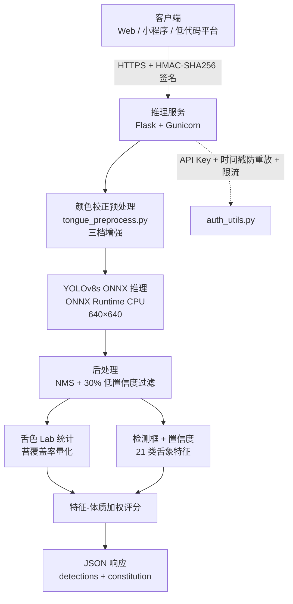

# TCM-Tongue Detection · 中医舌象目标检测（训练 + 云端推理）

[](https://www.gnu.org/licenses/agpl-3.0)
[](https://creativecommons.org/licenses/by-nc/4.0/)
[](https://www.python.org/)
[](https://github.com/ultralytics/ultralytics)
[](https://onnxruntime.ai/)
[](https://azure.microsoft.com/)

基于 YOLOv8s 的中医舌象病理特征检测项目：包含阿里云 PAI-DSW 上的训练复现材料，以及部署在
Azure App Service 上的云端推理服务代码（Flask + ONNX Runtime，带签名鉴权）。

**[模型权重（Releases）](../../releases)** · **[API 适配文档](docs/API.md)** · **[训练复现指南](training/TRAINING.md)** · **[在线应用演示](https://app-d6sw7q13ow75.appmiaoda.com/)**（基于本服务的完整舌诊产品）

- **检测能力**：舌色（红/紫）、舌形（胖大/瘦薄/齿痕/裂纹/红点）、舌苔（白/黄/黑/滑/剥）
  及心肺、肝胆、脾胃、肾等舌面分区局部凹凸特征，共覆盖论文 20 类病理特征体系
- **最终模型（v7）**：test 集 mAP@0.5 = **40.74%**，超过原论文全部 12 个基准模型
- **推理服务**：ONNX Runtime CPU 推理、颜色校正预处理、低置信度过滤、舌色 Lab 统计、
  苔覆盖率量化、API Key + HMAC-SHA256 签名防刷

> ⚠️ 本项目输出仅供健康参考与科研使用，不构成医疗建议。

---

## 目录结构

```
├── inference/            # 云端推理服务（Azure App Service 部署）
│   ├── app.py            #   Flask 服务：/predict /predict_base64 /health /labels
│   ├── auth_utils.py     #   HMAC-SHA256 签名 / 防重放 / 限流
│   ├── tongue_preprocess.py  # 舌象颜色校正预处理（三档增强）
│   ├── example_client.py #   调用示例（密钥走环境变量）
│   ├── requirements.txt
│   └── deploy_azure.ps1  #   一键部署到 Azure
├── training/             # 训练复现材料
│   ├── train.py          #   v7 训练脚本（YOLOv8s 复现入口）
│   ├── args_v7.yaml      #   v7 完整超参数（Ultralytics 训练自动生成）
│   ├── dataset.yaml      #   数据集配置（21 类名，含空类注释）
│   └── TRAINING.md       #   训练方法、版本演进、指标
├── tools/
│   ├── fix_dataset_v8.py             # 数据集标签审计修复（19 类连续标签实验版）
│   └── package_training_evidence.py  # 多版本训练证据打包与指标汇总
├── docs/
│   └── API.md            # 详细 API 适配文档（签名算法 + Python/JS 示例）
└── LICENSE               # AGPL-3.0
```

## 模型权重

权重通过 **GitHub Releases** 分发（见右侧 Releases 页面）：

| 文件 | 说明 | 配置 |
|---|---|---|
| `best.pt`（v7） | PyTorch 权重（21.5 MB） | YOLOv8s，**21 类**，输入 640×640 |
| `best_v7.onnx` | ONNX 导出（42.7 MB） | opset 19，输入 `images` [1,3,640,640]，输出 `output0` [1,25,8400] |

**加载配置**：Ultralytics ≥ 8.4（训练版本 8.4.51，PyTorch 2.10.0）；ONNX 推理用
onnxruntime ≥ 1.18。类别表（21 类）见 `training/dataset.yaml`。

权重许可：**CC BY-NC 4.0**（仅科研与非商业用途）。

## 系统架构



## 与论文基准的对比

训练数据来自 TCM-Tongue 数据集（Gao & Jin, 2026）。原论文在同一 test 集
（553 张，COCO 协议）上对 12 个主流检测模型做了基准测试，本作品 v7 的对比如下：

| 模型 | 参数量 | P/% | R/% | mAP@0.5/% | mAP@0.5:0.95/% |
|---|---|---|---|---|---|
| YOLOv8s（论文） | 11.1M | 40.75 | 35.52 | 33.54 | 27.98 |
| YOLOv11（论文最高） | 3.12M | 48.12 | 36.25 | 35.32 | 29.63 |
| **本作品 v7（YOLOv8s）** | 11.1M | **48.80** | 41.61 | **40.74** | 29.93 |
| 本作品 v5（YOLOv8m 对照） | 25.9M | 45.13 | 42.46 | 39.40 | **30.93** |

mAP@0.5 超论文同型号基准 **+7.20** 个百分点，超论文全部 12 个模型的最高值 **+5.42**
个百分点。逐类别 AP、8 个版本的迭代过程与训练配置差异归因见 `training/TRAINING.md`。

## 数据来源

- **数据集**：TCM-Tongue（Gao & Jin, 2026），北京工商大学计算机与人工智能学院发布，
  6,719 张标准化采集舌象图像，CC BY 4.0 协议
- **数据集仓库**：https://github.com/m28805746-max/Intelligent-tongue-diagnosis-detection-dataset
  （Dryad 同步发布，v3.0）
- **使用注意**：发布版类名表与论文 Table 1 存在错位（多出空类 piweitu），且 test 集
  `A (195).txt` 含越界标签——详见 `training/TRAINING.md` 与 `tools/fix_dataset_v8.py`

## 引用

```text
GAO L, JIN X. A tongue image dataset with pathological annotations for AI-assisted
diagnosis in traditional Chinese medicine[J]. Biomedical Informatics and Smart
Healthcare, 2026, 2(1): 5-19. DOI: 10.62762/BISH.2026.303296.
```

arXiv 预印本：arXiv:2507.18288（TCM-Tongue: A Standardized Tongue Image Dataset
with Pathological Annotations for AI-Assisted TCM Diagnosis）

## 复现步骤

```bash
# 1. 训练（需 GPU；数据集按上文来源下载解压）
cd training
python train.py --data /path/to/shezhenv3-coco/dataset.yaml

# 2. 评估（test 集官方协议）
yolo val model=runs/train/weights/best.pt data=/path/to/shezhenv3-coco/dataset.yaml split=test

# 3. 导出 ONNX 并部署推理服务（见 inference/ 与 deploy_azure.ps1）
yolo export model=runs/train/weights/best.pt format=onnx imgsz=640 opset=19 simplify=True

# 4. 本地起服务
cd inference
pip install -r requirements.txt
export API_KEYS_JSON='{"my-key-id": "my-secret"}'   # 配置你的密钥对
python app.py                                        # http://localhost:8000
```

调用方式（签名算法、错误码、Python/JS 完整示例）见 **docs/API.md**。

## 许可与致谢

- 本仓库代码：**AGPL-3.0**（模型基于 Ultralytics YOLOv8 训练，遵循其 AGPL-3.0 许可）
- Ultralytics YOLOv8：https://github.com/ultralytics/ultralytics（AGPL-3.0）
- TCM-Tongue 数据集：CC BY 4.0（Gao & Jin, 2026）
- 模型权重：CC BY-NC 4.0（非商业用途）
