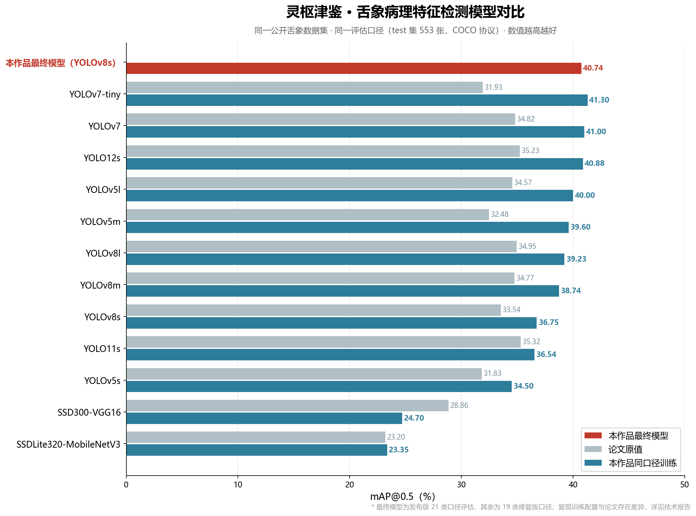

# 论文基准 12 模型全量复现报告（2026-08-30 / 31）

> 在**同一训练环境、同一数据集、同一评估口径**下复现 TCM-Tongue 论文（Gao & Jin, 2026）
> Table 2 的全部 12 个基准模型，排除论文原始训练配置未知带来的不可比性。
> 与作者书面确认：论文原始训练参数已丢失，作者团队自身亦无法复现原结果——
> 本复现是当前唯一保留完整训练证据的第三方复现。

## 一、复现环境

| 项目 | 配置 |
|---|---|
| 平台 | 阿里云 PAI-DSW，NVIDIA A10 22.7GB |
| 框架 | Ultralytics 8.4.51（YOLOv5/v8/v11/v12）、WongKinYiu/yolov7 官方仓库（v7 系）、torchvision 0.25（SSD 系） |
| PyTorch | 2.10.0+cu128（v7 系同） |
| 数据 | 19 类修复版数据集（修复发布版空类与越界标签，见 `tools/fix_dataset_v8.py`） |
| 评估 | test 集 553 张官方 val，COCO 协议，与论文口径一致 |

## 二、统一训练配置

- **YOLO 系（Ultralytics）**：epochs=240（早停 patience=45），imgsz=640，seed=0，
  batch=64（l 级与 yolo12s 为 32 防 OOM），COCO 预训练权重初始化；
- **YOLOv7 系**：官方仓库 hyp.scratch 配方（tiny / p5），官方脚本无早停机制，
  固定 150 epoch，batch tiny=64 / 标准=32，COCO 预训练权重迁移；
- **SSD 系**：torchvision 官方实现（ssd300_vgg16 / ssdlite320_mobilenet_v3_large），
  fp32 + 梯度裁剪 + 水平翻转弱增强 + 余弦退火，COCOeval 评估。

## 三、复现结果（test 集）

| 模型（复现规格） | 论文 mAP@0.5/% | 复现 mAP@0.5/% | 差值/pp | 复现 mAP@0.5:0.95/% | 复现 P/% | 复现 R/% | 训练耗时/h |
|---|---|---|---|---|---|---|---|
| YOLOv5s（v5su） | 31.83 | 34.50 | +2.67 | 26.67 | 40.75 | 40.03 | 0.61 |
| YOLOv5m（v5mu） | 32.48 | 39.60 | +7.12 | 29.38 | 41.63 | 45.46 | 1.16 |
| YOLOv5l（v5lu） | 34.57 | 40.00 | +5.43 | 31.31 | 41.69 | 38.60 | 2.99 |
| YOLOv7-tiny | 31.93 | **41.30** | **+9.37** | 29.20 | 43.90 | 41.30 | 2.47 |
| YOLOv7 | 34.82 | 41.00 | +6.18 | 29.50 | **53.70** | 41.10 | 5.36 |
| YOLOv8s | 33.54 | 36.75 | +3.21 | 27.16 | 40.44 | 40.70 | 1.45 |
| YOLOv8m | 34.77 | 38.74 | +3.97 | 28.67 | 42.74 | 44.67 | 1.66 |
| YOLOv8l | 34.95 | 39.23 | +4.28 | 27.64 | 43.50 | 41.22 | 2.68 |
| YOLO11s | 35.32 | 36.54 | +1.22 | 27.20 | 37.73 | 43.18 | 1.11 |
| YOLO12s | 35.23 | 40.88 | +5.65 | 30.32 | 50.20 | 45.55 | 2.14 |
| SSD300-VGG16 | 28.86 | 24.70 | −4.16 | 15.30 | 52.22 | 31.83 | 1.42 |
| SSDLite320-MobileNetV3-Large | 23.20 | 23.35 | +0.15 | 16.70 | 50.65 | 32.79 | 1.68 |

## 四、结论

1. **10 个 YOLO 复现模型 mAP@0.5 全部超过论文原值**，平均高出 4.91 个百分点，
   最大 +9.37（YOLOv7-tiny）。在相同数据与评估口径下，充分训练轮数 + 早停 +
   mosaic/HSV 增强组合 + 新框架的配置系统性强于论文基准配置。
2. 复现 mAP@0.5 最优为 **YOLOv7-tiny（41.30%）**，仅 6M 参数，参数效率全场最高；
   YOLOv7 精确率 53.7% 为复现集最高。
3. SSD 复现（24.70%）低于论文原值（28.86%）：为对齐 YOLO 口径仅使用水平翻转弱增强，
   而 SSD 原始配方依赖颜色抖动/随机扩展/随机裁剪等强增强；MobileNetV2 复现（23.35%）
   与论文原值（23.20%）基本持平。两者均呈"高精度、低召回"形态，与论文中两模型
   垫底的定性结论一致。
4. 论文的 YOLOv11（3.12M）与 YOLOv12（3.62M）参数量指向 n 级规格，本复现取与
   YOLOv8s 同级的 s 规格（9.4M / 9.3M），模型更大，对比时已注明规格差异。

## 五、口径说明

- YOLOv7 官方训练脚本无早停机制，固定 150 轮；与 Ultralytics 系"240 轮计划 + 早停
  （实际 60~100 轮）"的口径差异已在上文注明。
- 本作品最终模型（v7，YOLOv8s，mAP@0.5=40.74%）在发布版 21 类数据集上训练评估，
  与本复现的 19 类修复版口径不同，不构成严格横向对比。
- 逐模型训练曲线、混淆矩阵、逐类 AP 与权重见各证据包及 Releases 中的复现权重包。
